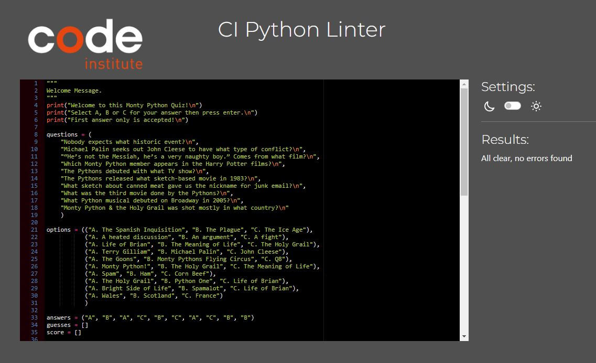

# Monty Python Quiz

Welcome to a [Monty Python Quiz!]()

The quiz is designed for users that like the comedic team known as Monty Python and can test their knowledge in this 10-question quiz.

## How to play
<ol>
<li>The user must read a question and 3 possible answers.</li>
<li>They must then select either A, B or C then press Enter.</li>
<li>The computer will automatically reveal the next question.</li>
<li>Once at the end of the game the user can see their results and choose
if they would like another try or to end the quiz.</li>
</ol>

## Features

<li>Within the quiz there is a welcome message that shows at the very top letting users know that they are about to take a quiz on Monty Python.</li>
<li>There are also instructions letting the user know to enter their answer using a, b or c and then press enter to confirm their selection.</li>
<li>Once the user has confirmed their answer with enter the result will be displayed to the user and the next question will appear below ready for them to answer.</li>
<li>When the user gets to the end of the quiz their results will show giving them a score out of the total amount of questions.</li>
<li>The user is asked after their results if they would like to play again. They can input ‘yes’ and the quiz will restart or ‘no’ and a ‘Thank you for playing message’ will show ending the quiz. If the user inputs anything other than ‘yes’ or ‘no’ and error message will show asking the user to enter either ‘yes’ or ‘no’.</li>

## Design Considerations

Given features intended within the game external libraries not required as native code is sufficient to support the required functionality.

## Test Cases

### On start of quiz welcome banner will be displayed.

### Game rules will be displayed and readable:
<li>Use of break lines and correct grammar i.e uppercase.</li>

### On user input of answer the game will validate and display:
<li>Correct Answer : Comparing user input to defined answer and increment current score by 1.</li>
<li>Incorrect Answer : Where user input is in defined list of available values but not correct.</li>
<li>Invalid Input: Where user input is not in defined list of available values.</li>
<li>After evaluation present user with the next question.</li>

### The score is incremented after each correct answer:
<li>Ensure that correct answers entered equals the returned final score.</li>

### Replay feature options:
<li>If user selects yes game will restart and score will be reset to zero.</li>
<li>If user selects no game will terminate and a thank you message will be displayed to the user.</li>
<li>If the user inputs any value other than yes/no the question will be presented again.</li>

## Bugs

### Solved Bugs

### Unfixed Bugs
No bugs present in code.
<li>A future feature I would like to include would be to categorized the questions into sub-topics i.e. movie/actor related questions.</li>
<li>Add database to support questions on multiple topics.</li>

## Deployment

I have deployed my site using Heroku.
<ol>
<li>Create a new Heroku App.</li>
<li>Set the buildbacks in order to Python and NodeJS.</li>
<li>Link my Heroku app to my github repository.</li>
<li>Click on deploy</li>
</ol>

## Validator Testing

I tested my code in PEP8 which returned no errors.

## Credits

<li>Code Institute for basic workplace template.</li>
<li>Information on Monty Python for the quiz questions and answers from Wikipedia and (https://www.montypython.com)</li>

